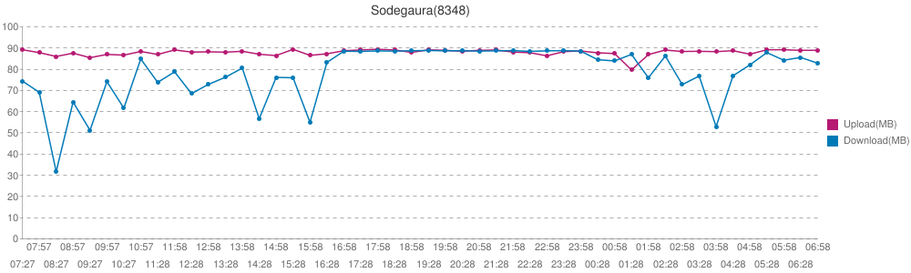

# periodic-speedtest

A tiny wrapper for speedtest-cli, which allows you to test internet speed *periodically*.


## Usage

```console
wget https://raw.githubusercontent.com/amaya382/periodic-speedtest/master/periodic_speedtest -O speedtest
chmod +x speedtest

# Since it takes a long time, recommended to be run on tmux or screen
./speedtest [-n num_of_times=60, -i interval(min)=1, -s server_id=autodetection] results_file_prefix
```

And then you should get results in table (csv) and chart (png)




## Acknowledgement

* [sivel/speedtest-cli](https://github.com/sivel/speedtest-cli)
